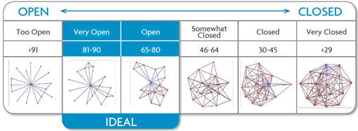

```{r echo=FALSE, message=FALSE}
library(gdata)
library(igraph)
library(reshape)
library(plyr)
library(scales)
library(ggplot2)
```


```{r echo = FALSE, message = FALSE}
# read in data from Excel
respondent <- read.xls("LND_data_Curtis.xlsx", sheet = 1, header = TRUE)
connections <- read.xls("LND_data_Curtis.xlsx", sheet = 2, header = TRUE)
network <- read.xls("LND_data_Curtis.xlsx", sheet = 3, header = TRUE, na.strings=c("NA",""))
```

```{r echo = FALSE, results = FALSE}
# inspect data
str(respondent)
str(connections)
str(network)

# view data
head(respondent)
head(connections)
head(network)
```

```{r echo = FALSE}
# change data types where needed
respondent$name <- as.character(respondent$name)
```


```{r echo = FALSE}
# change data types where needed
connections$name <- as.character(connections$name)

# filter connections to complete rows only
connections <- connections[complete.cases(connections),]
```


```{r echo = FALSE}
# convert network to char
network[] <- lapply(network, as.character)

# subset network to only rows/connections
network <-network[c(1:12), c(1:13)]

# set first column as rownames
rownames(network) <- network$X7

# drop name column
network$X7 <- NULL

# set NA to 0
network[is.na(network)] <- 0

# transform network into matrix
m <- as.matrix(network)
```

Welcome to the results of the Leader Network Diagnostic. The purpose of this document is to help you understand your core professional network.

## Network Visualization

In this section, we are going to show you what your core professional network looks like.

```{r echo=FALSE, fig.align="center"}
# load network into graph
g <- graph_from_adjacency_matrix(m, weighted = TRUE, mode = "undirected")

# inspect the graph
#g

# calculate layout
l <- layout_with_fr(g)

# plot graph
plot(g, 
     vertex.size=25,
     vertex.color="gray",
     vertex.label.color="black",
     vertex.label.cex=0.5,
     edge.curved=.1,
     edge.width=E(g)$weight,
     layout=l
     )
```

## Open

Openness measures the degree to which the people in your network know one another.

<center>

</center>

## Diverse

Diversity measures the degree to which the people in your network are similiar or not similiar to one another.

```{r echo=FALSE, results='hide', fig.align="center"}
# subset helpful responses
helpful <- connections[c("name", 
                         "work", 
                         "friend", 
                         "support", 
                         "career",
                         "mentoring",
                         "growth",
                         "motivator"
                         )]

#reshape the helpful data
helpful.m <- melt(helpful, id="name")

# rescale variables
helpful.m <- ddply(helpful.m, .(variable), transform, rescale = rescale(value))

# plot heatmap of name by helpful
ggplot(helpful.m, aes(name, variable)) + 
  geom_tile(aes(fill = rescale),colour = "white") + 
  scale_fill_gradient(low = "white", high = "firebrick4") +
  theme(legend.title=element_blank(), 
        axis.title.x=element_blank(),
        axis.title.y=element_blank(), 
        axis.text.x = element_text(angle = 90, hjust = 1))
```

## Deep

Depth measures the strength of the relationship you have with the people in your network.


